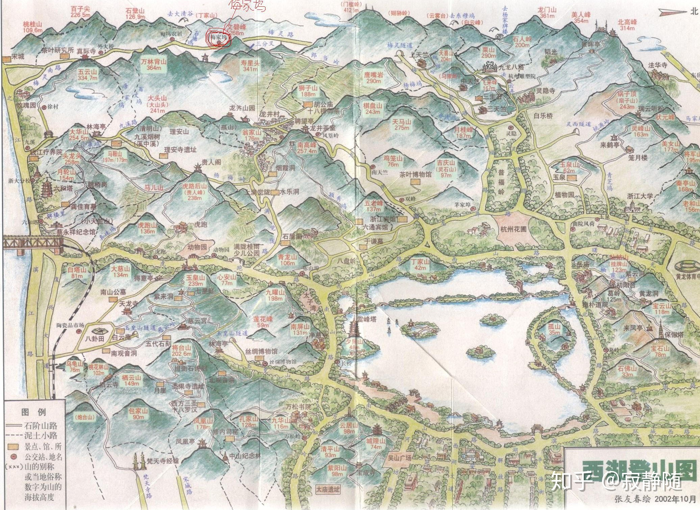
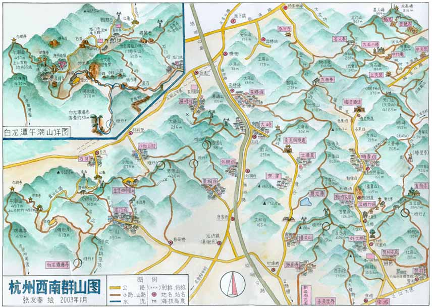
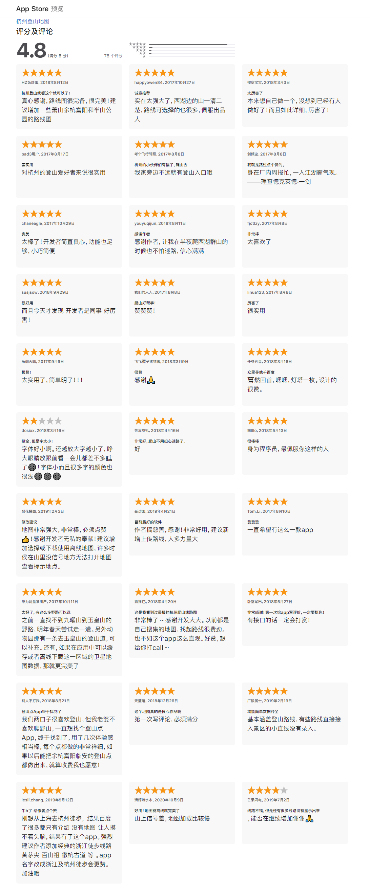

# 杭州登山地图收集

## 目标

本项目主要收集了市面上杭州登山地图，手绘图，线路图等。

之前登山主要看手机上高德地图、百度地图等app，但是这些地图app上的信息都不太完善，有些支路、野路以及上山口都没有标，还有一些路是通到一些茶园里面的，也不知道这些茶园是不是私人的，能不能走出来。

## 纸质时代

网上搜索了一圈，在纸质地图时代，有一个登山友——张友春，手绘了众多西湖登山地图，包括东北群山，龙坞群山，西南群山等。算是给众多爬友提供了第一首信息。





另外还有一份是《2012西湖登山地图》，由李松涛提供，原版本是一个31M的pdf扫描文件，我看比较大，用  imagemagick 转成了jpg图片，并且压缩到5M以内，肉眼看基本没有信息丢失。（另外这份文件里面还有FM89推荐的10条登山路线）。


其他还收集了一些地图，都在map/ 目录下。有一些是浙大毅行路线以及天择户外提供的一些路线。

```
2012西湖登山地图.jpg
半山景区山径图.jpg
杭州登山全景地图-阿里元芳.jpg
杭州东北群山图（半山山脊，半山—天都城）-张友春.jpg
杭州市区山径图（《杭州的山》一书所附带）.jpg
杭州西南群山图（张友春绘）.jpg
杭州西山游步道地图.gif
龙坞群山图（张友春绘）.jpg
旅途中国2007西湖毅行线路图.gif
爬山去.jpg
天择户外2006毅行西湖群山图.jpg
西湖登山图2002.jpg
西湖风景名胜区登山旅游图.jpg
西湖区西山旅游地图.JPG
萧山景区山径图.jpg
浙大毅行路线.jpg
```

## 信息时代

然后到了信息时代，阿里云有个花名叫元芳的同学，也在找杭州登山的路线，他基于gps定位采集，开发了一个app，优势有：

> 1. APP中标示路线大部分基于以上提到的两款纸质地图，再加上广大驴友公开分享的爬山路线轨迹，其中大部分均由本人亲自走过，基于GPS采集路线信息，对于原纸质地图中标识的部分实勘未找到的路线进行了删减，路线信息准确、真实可靠性高；
> 2. APP中对主干线、支线、野路进行了分别标识，便于大家选择路线，以及辨识行进途中的分叉口；
> 3. APP中对主要山峰、登山入口的位置、海拔信息进行了标注，便于大家了解路线的相对海拔；
> 4. APP中给大家分类推荐了不同难度的路线，有纯休闲徒步的、短距离经典线路、野路精选、以及各项正规比赛路线，让你可以更好的了解杭州，爱上杭州；
> 5. APP中支持高德、谷歌的多种地图图层自由切换，满足不同用户习惯；
>


具体用法我就不介绍了，大家可以看这两个链接：

1. 杭州西湖最全爬山登山路线图经典推荐-杭州登山地图APP https://www.jianshu.com/p/2b7c4ca8da92 ，App Store地址：https://apps.apple.com/cn/app/id1267234289
3. 【转载】推荐一个app，收纳杭州最全登山地图！附亲测过的亲子徒步路线推荐 https://www.jianshu.com/p/d29d3d770a4e

有了这个app就方便很多了（简直开了天眼了），有支路、野路、上山口子等等。特别是他提供了很多路线，点击对应的路线，会在地图上给你标注出来。

Apple store上可以看到这个app的好评度之高。（顺便吐槽一下apple store字体真小，我是改了css增大字体的）



~~貌似没有找到安卓的apk，ios系统安装是没问题的。~~（安卓的apk在一个下载站找到了，我也作为资源放到这个repo里面。）

## 路线

下面这些路线是我从app里面提取出来的。

### 核心主干线

| 线路 | 描述 |
| ---- | ------ |
|十里琅珰|始于梅灵北路上天竺，经狮子山、狮峰、万林背山、五云山，下至九溪口，中途可达龙井、梅家坞、灵隐。相传该段山路是股市挑担货郎摸索出的，山路上都是货郎担子、叮铃当啷之声，故又名“十里郎当”，全长约7KM|
|十里龙脊|始于古荡老和山，沿将军山、状元峰、北高峰、美人峰、石人岭、狮子笼、竹竿山、严家山、茶坞山、北车坞、丁家山、太坞山，百子尖、桃桂山、至于大诸桥孟坞，可直抵宋城，是杭城最为核心成熟的登山路线，沿途可达浙大玉泉校区、植物园、灵隐、法华、上中下天竺、梅家坞、花坞、留下、大清谷、云栖等等，全长约16KM|
|百里如意|北起留下街道屏峰社区老年活动中心小屏峰，途经屏峰山、老焦山、金莲寺、小和山、狮子山、白龙潭、飞凤岩、黄梅山、鸡笼顶、龙尾巴山、白岩山、金家岭、西湖山、大岭、如意尖（杭城最高峰，海拔536米）、野山头、狗头山、石门坞、牛背岭、西山，南端终点在双浦镇风水洞口；由于和这条主线相连的支线游步道，不仅包括西湖区的，还连通余杭区、富阳市，因为连通的支线数量多，所以取名为“百里如意”，全长约30KM|
|西溪谷慢行道|始于古荡双口井，沿西溪路南边山麓而行，专门为休闲散步而设计，只有很小幅的缓坡，经马家坞、东岳、大小龙驹坞、大小花坞、杨家牌楼，止于留下西穆坞，全长约13KM|


### 短线休闲

| 线路 | 描述 |
| ---- | ------ |
|万松书院至梵天寺|始于万松书院，经老虎洞、凤凰山、栖云寺，止于梵天寺，途中有多处南宋历史遗迹，可了解杭城相关历史文化，全长约2KM|
|四眼井至南屏晚钟|始于四眼井，向北上山经九䂂山、荔枝峰、南屏山，止于南屏晚钟，其中九䂂山为环西湖的最高峰，全长约2KM|
|玉泉山至古荡老和山入口|始于植物园内玉泉山，每年3月左右可观灵峰探梅，经杭城西北面最高峰将军山，止于老和山古荡主入口，全长约2KM|
|儿童公园至六和塔|始于杭州少年儿童公园，经虎跑寺上山，在贵人阁可远眺翁家山群山、以及江干风情，再经马儿山岗、头龙头到达六和塔，全长约4KM|
|龙井寺至茶叶博物馆|始于龙井村龙井寺，缓阶而上，向北经棋盘山、天马山、过吉庆山、下至茶叶博物馆，全长约3KM|
|黄龙洞至宝石山|始于曙光路上的黄龙洞，向南而上，经挂牌山后向东前往宝石山、保俶塔，最后下山至宝石山下一弄，途中西湖全景尽收眼底，全长约2KM|
|北高峰小环线|始于灵隐寺旁，向北而上至天下第一神庙，在北高峰远眺西湖，灵隐、韬光、永福、佛学院尽收眼底，后经美人峰，下山至法云弄，全长约3KM|
|迷你十里琅珰|始于龙井村十里琅珰牌坊，向西上山至狮峰，向西而下至梅家坞十里琅珰牌坊，全长约3KM|
|上满觉陇至三台山|始于上满觉陇，向北上山经千人洞、南高峰、五老峰，下山至三台山路，全长约2KM|


### 赛事精选

| 线路 | 描述 |
| ---- | ------ |
|2015VASQUE西湖跑山赛|杭城历史最悠久的跑山品牌赛事，从2006年开始已经10年了，始于植物园灵峰探梅停车场，经桃园岭、状元峰、北高峰、美人峰、龙门山、石人岭、佛学院、天竺山、狮峰、万林背山、五云山、林海亭、九溪烟树、上满觉陇、南高峰、五老峰、吉庆山、灵隐路，最后回到出发点，全程逆时针而行，串联起十里龙脊、十里琅珰、南高峰相关路线，全长约28KM|
|2016VASQUE西湖跑山赛|移师钱塘江边，始于白塔公园，经复兴路、水澄路、八卦田、乌龟山、栖云寺、玉皇山、大慈山、香樟雅苑、贵人阁、水乐洞、南高峰、五老峰、茶叶博物馆、吉庆山、天马山、棋盘山、寿星头、万林背山、五云山、老虎山、林海亭、马鞍山、头龙头、革命烈士纪念馆、白塔山，至于出发点白塔公园，全程逆时针而行，核心穿越玉皇山、南高峰、十里琅珰，全长约30KM|
|2016嗨跑杭州山地越野赛|嗨跑旗下品牌赛事，从2014年开始举办，路线始于茅家埠，经茶叶博物馆、吉庆山顶、中天竺、佛学院、枫树岭岔口、天竺山、十里琅珰、五云山真迹寺、九溪玫瑰园、螺髻峰、贵人阁、翁家山（烟霞洞）、南高峰回到起点，全程逆时针而行，核心穿越十里琅珰、南高峰，全长约25KM|
|2016吉武杭州山地越野赛超级组|吉武旗下品牌赛事，从2012年开始举办，路线始于茶叶博物馆，经三台阁、南高峰、宏法坞、杨梅岭、翁家山、你我茶燕园、九溪十八涧、寿星头、狮子山、云西坞、九溪烟树、马儿山岗、头龙头、大华山、林海亭、五云山、西湖花园、秤砣山、云栖竹径、太坞山、白云深处、九曲亭、狮子笼、天门山、狮峰、中印庵、石人亭、龙门山、佛学院、小西天、中天竺、杨梅弄、棋盘山、天马山、最后回到茶叶博物馆，全程顺时针而行，内含几个小环线，全长约50KM|
|2016吉武杭州山地越野赛全程组|吉武旗下品牌赛事，从2012年开始举办，路线始于茶叶博物馆，经三台阁、南高峰、宏法坞、杨梅岭、翁家山、大人峰、你我茶燕园、九溪十八涧、寿星头、狮子山、云西坞、九溪烟树、马儿山岗、珍珠坞、头龙头、大华山、林海亭、五云山、梅家坞、梅灵南路、白云深处、大岗、九曲亭、狮子笼、天门山、狮峰、棋盘山、天马山、最后回到茶叶博物馆，全程顺时针而行，全长约35KM|
|2016JD杭州山地马拉松赛全程组|也是吉武旗下品牌赛事，从2013年开始举办，路线始于青芝坞，经桃源岭、北高峰、美人峰、佛学院、天竺山、十里琅珰、梅家坞、茶坞山、大清谷、外桐坞村、泮家山、老焦山、哩哗山、屏峰山、大岭山、罗坟尖、竹竿山、九曲亭、永兴寺、西溪谷漫步道、美女山、最后回到青芝坞，全程顺时针而行，串联起十里龙脊、十里琅珰、百里如意、西溪谷慢行道全杭四大核心路线，堪称最美最嗨，全长约42KM|
|浙大毅行-西湖群山标准毅行|始于浙大玉泉校区，经将军山、美女山、桃园岭、北高峰、美人峰、石人岭、天竺山、狮峰、十里琅珰、五云山、林海亭、马鞍山、虎跑后山、杭州少年儿童公园、玉皇山、将台山、万松书院、云居山、城隍阁，止于吴山广场，全程环西湖逆时针而行，连通十里龙脊和十里琅珰这两条最核心成熟登山路线，途中多处不仅可鸟瞰西湖全貌，还可远眺钱塘江，真是美不胜收，每年坚持毅行一次，绝对让你更爱杭州！全长约27KM|
|西部越野赛-西部群山疯浙线|始于灵山风水洞，经牛背岭、狗头山、如意尖、老虎山、金家岭、白岩山、飞凤岩、午潮山、龙门岭、金莲寺、屏峰山、竹竿山、石人岭、美人峰、北高峰、桃园岭、将军山，止于古荡老和山主入口，全程穿越周浦、龙坞、西湖三大山脊，连通百里如意和十里龙脊，近30座山峰累计爬升接近4000米，绝对爽到极点！全长约43KM|


### 野路精选

| 线路 | 描述 |
| ---- | ------ |
|九曲亭下山至永兴寺|始于十里龙脊主干道九曲岭，经永兴寺边上的山坳墓群下山，全程山林野路，挑战在于要经过长达500米的墓群，害怕不？约1.5KM|
|龙门亭下山至金鱼井村|始于十里龙脊主干道龙门亭，止于金鱼井村后的龙驹西路，前半程山林野路，后半程石阶道路，中间会穿越工商大学武装学院的训练区，沿途有风险提醒，一般没事，还能一路畅听军歌，全长约2KM|
|太坞山下山至梅灵南路|始于十里龙脊主干道太坞山，沿梅家坞侧而下，止于梅灵南路外大桥民居，全程山林野路，最后一段实在太野，让人抓狂，沿小溪左右穿行，等你看到希望就在前方时却被九溪河隔断，只能沿河而行，民居家里却突然涌出5、6条狗朝你狂叫，着实吓人，堪称最野路线，超强推荐！全长约1.5KM|
|狮峰下山至九溪十八涧中段|始于十里琅珰主干道狮峰，止于九溪十八涧慢行道的中段，全程山林野路，前半段沿山顶一路向西，在寿星头附近有几个瞭望台，没有树木遮挡，视野非常棒，可以鸟瞰对面的十里琅珰主干道和梅家坞！路线的尽头是九溪，需要过河才能到达十八涧慢行道，若遇涨水就没法过了，全长约1.5KM|
|五云山附近伏虎亭下山至九溪林海亭|始于十里琅珰主干道五云山顶下几百米处的伏虎亭，止于九溪路上的林海亭，全程山林野路，关键是最后一小段是从山间河道里面走的，若遇下雨溪水上涨会很危险，若沿河边茶地而行，必须选对边，不然永远过不了河！全长约1.5KM|
|灵山景区新塘上山至牛背岭中|始于灵山幻境景区南面山脚的新塘村，沿山而上，入口是一个废弃的矿山，虽是全程标准石阶路，但由于行走人员实在太少，路边的杂草完全覆盖了石阶，非野路但堪比野路！全长约1.8KM|
