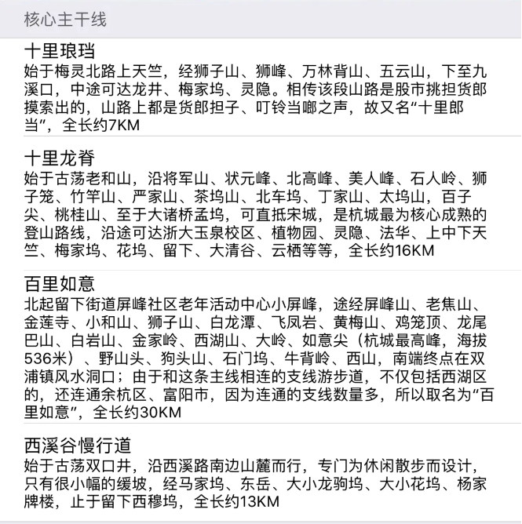
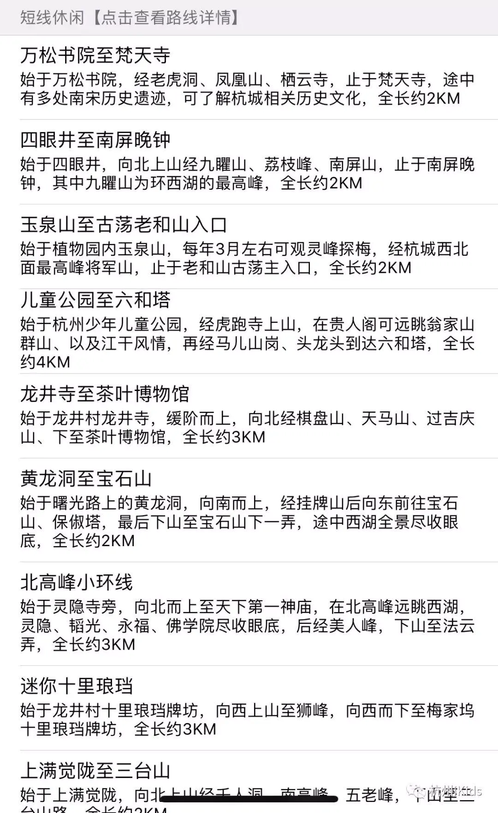

# 杭州登山地图收集

## 目标

本项目主要收集了市面上杭州登山地图，手绘图，线路图等。

之前登山主要看手机上高德地图、百度地图等app，但是这些地图app上的信息都不太完善，有些支路、野路以及上山口都没有标，还有一些路是通到一些茶园里面的，也不知道这些茶园是不是私人的，能不能走出来。

## 纸质时代

网上搜索了一圈，在纸质地图时代，有一个登山友——张友春，手绘了众多西湖登山地图，包括东北群山，龙坞群山，西南群山等。


另外还有一份是《2012西湖登山地图》，由李松涛提供，原版本是一个31M的pdf扫描文件，我看比较大，用  imagemagick 转成了jpg图片，并且压缩到5M以内，肉眼看基本没有信息丢失。（另外这份文件里面还有FM89推荐的10条登山路线）。


其他还收集了一些地图，都在map/ 目录下。有一些是浙大毅行路线以及天择户外提供的一些路线。

```
2012西湖登山地图.jpg
半山景区山径图.jpg
杭州登山全景地图-阿里元芳.jpg
杭州东北群山图（半山山脊，半山—天都城）-张友春.jpg
杭州市区山径图（《杭州的山》一书所附带）.jpg
杭州西南群山图（张友春绘）.jpg
杭州西山游步道地图.gif
龙坞群山图（张友春绘）.jpg
旅途中国2007西湖毅行线路图.gif
爬山去.jpg
天择户外2006毅行西湖群山图.jpg
西湖登山图2002.jpg
西湖风景名胜区登山旅游图.jpg
西湖区西山旅游地图.JPG
萧山景区山径图.jpg
浙大毅行路线.jpg

```

## 信息时代

然后到了信息时代，阿里云花名元芳的同学，也在找杭州登山的路线，他基于gps定位采集，开发了一个app，优势有：

> 1. APP中标示路线大部分基于以上提到的两款纸质地图，再加上广大驴友公开分享的爬山路线轨迹，其中大部分均由本人亲自走过，基于GPS采集路线信息，对于原纸质地图中标识的部分实勘未找到的路线进行了删减，路线信息准确、真实可靠性高；
> 2. APP中对主干线、支线、野路进行了分别标识，便于大家选择路线，以及辨识行进途中的分叉口；
> 3. APP中对主要山峰、登山入口的位置、海拔信息进行了标注，便于大家了解路线的相对海拔；
> 4. APP中给大家分类推荐了不同难度的路线，有纯休闲徒步的、短距离经典线路、野路精选、以及各项正规比赛路线，让你可以更好的了解杭州，爱上杭州；
> 5. APP中支持高德、谷歌的多种地图图层自由切换，满足不同用户习惯；
>


具体用法我就不介绍了，大家可以看这两个链接：

1. 杭州西湖最全爬山登山路线图经典推荐-杭州登山地图APP https://www.jianshu.com/p/2b7c4ca8da92
2. 【转载】推荐一个app，收纳杭州最全登山地图！附亲测过的亲子徒步路线推荐 https://www.jianshu.com/p/d29d3d770a4e

有了这个app就方便很多了，特别是他提供了很多路线，点击对应的路线，会在地图上给你标注出来。



  

貌似没有找到安卓的apk，ios系统安装是没问题的。

